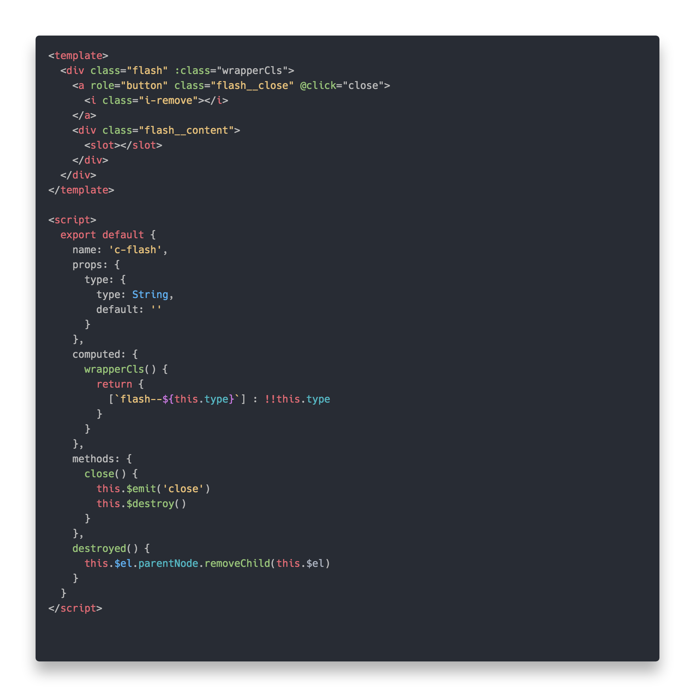

# Polacode

This is a customized fork of [octref/polacode](https://github.com/octref/polacode)

- Remove container background, make it transparent
- Modify content box-shadow, make it more smooth

## Why?

Contribution is extremely unwelcome for Polacode. I make my own, including lots of features from other repos. Fixing bugs would drill me some holes.